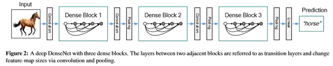
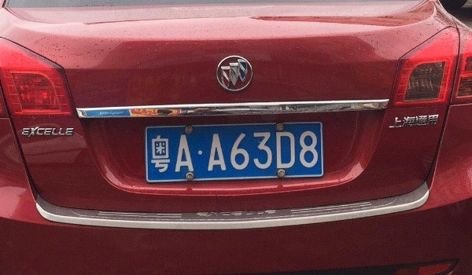
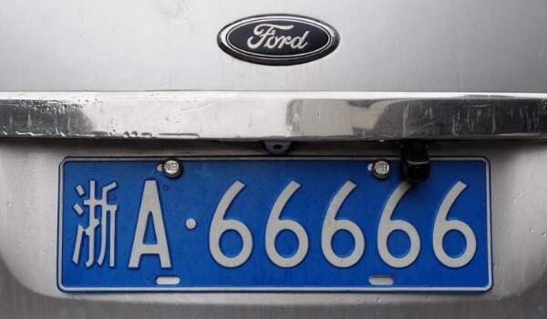

# Cross calling of Matlab and Python: Edge cutting and Text recognition System

As a little group work of my computer vision course, I am glad to release the code for the purpose of sharing and learning. As this project contain cross call of Matlab and Python, and the final result is pretty cool. 

The text detection engine cnocr used in this experiment borrows from the open source project https://github.com/breezedeus/cnocr
The model is mainly aimed at simple typesetting text, such as chat records, scanned documents, etc., using the built-in deep learning model to capture, as if it is instantly disconnected from the network, the toy model can also play a role, just for more suitable car license and other picture shooting situations. Need to cooperate with other engines for processing.
There are countless network models that can be used for text recognition based on pytorch. Different models have their own advantages and disadvantages for different scenarios. The model used this time belongs to a type of deep network, which is currently a better model for deep text detection. The structure of the network is as follows:

|  | 2021-11-19 18:59:03 -: Name: 0129145.bmp      ['粤', 'A', '·', 'A', '6', '3', 'D', '8'] |
| ------------------------------------------------------------ | ------------------------------------------------------------ |
|  | 2021-11-19 18:59:05 -: Name: 3152010.bmp      ['浙', 'A', ':', '6', '6', '6', '6', '6'] |
|  | 2021-11-19 18:59:19 -: Name: 0234f8f5923b5c4824837017a480cd2.bmp       ['C', 'e', 's', 't', 'b', 'O', ')', '/', '/'] |

##### From the results, the overall recognition rate of the license plate is generally good,  while the text recognition on the surface of a round object is more challenging,  so the effect is relatively not so satisfactory.

## Getting Started:
- `./CrossCall.py ` : run this.

-  .m executable app is required to call ` Pcut.m`

